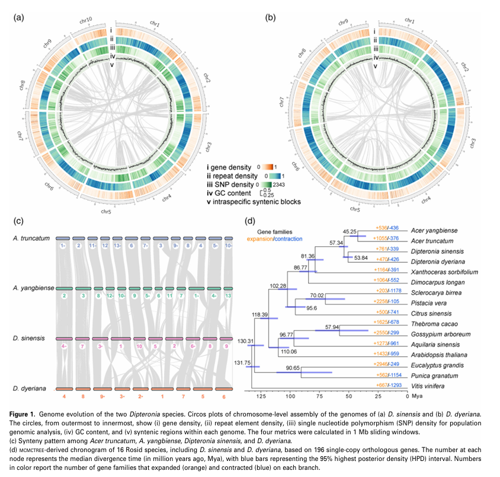
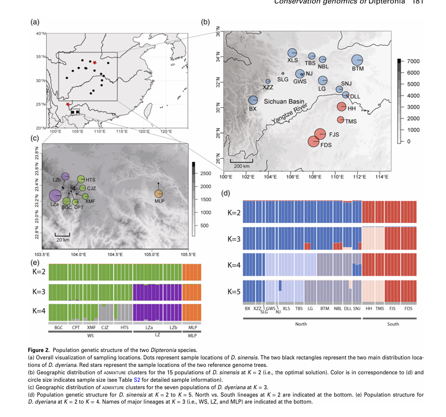
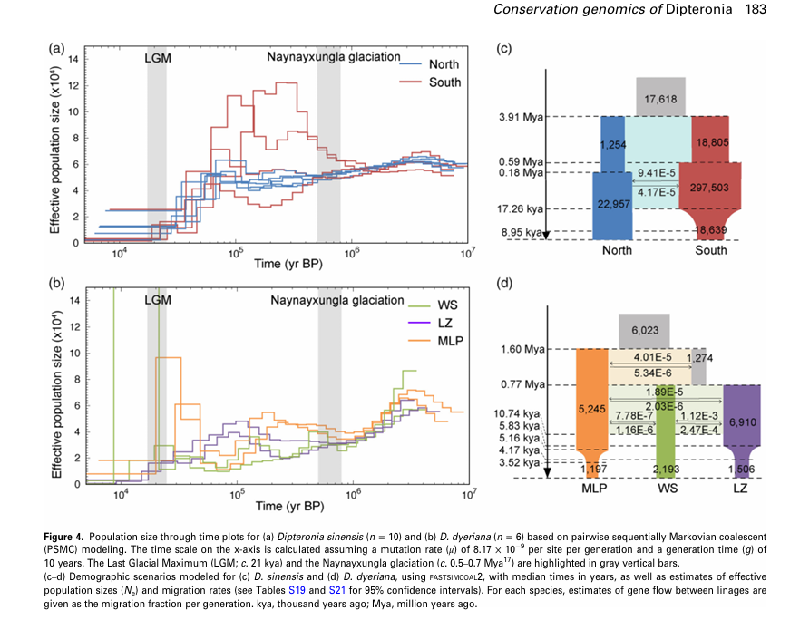
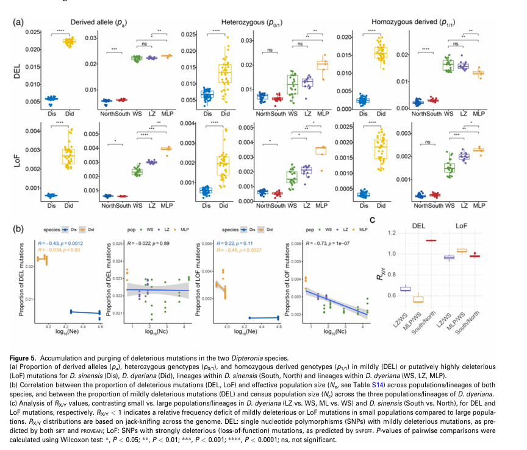

# 每周文献 | "活化石"双翅槭的保护基因组学

**2026.04.06** | 字数 2,856 | 阅读时长 8分钟

---

不同于动物可以迁徙逃避不利环境，植物只能原地应对气候变化和栖息地破坏。在漫长的地质历史中，一些古老的植物谱系存活至今，被称为"活化石"。然而，这些孑遗植物在现代面临着严峻的生存挑战。它们为何能存活数千万年？又为何在今天濒临灭绝？遗传负荷在其中扮演什么角色？

今天我们分享一篇来自The Plant Journal的文献，通过双翅槭属两个物种的基因组和种群基因组学研究，揭示"活化石"植物从繁盛到濒危的遗传学机制。我们也可以从中思考如何用保护基因组学指导濒危植物（如卵叶海桑）的保护实践。

## 文章信息

- **题目**: Genome sequences and population genomics provide insights into the demographic history, inbreeding, and mutation load of two 'living fossil' tree species of Dipteronia
- **期刊和时间**: The Plant Journal, 2024年1月（影响因子7.2）
- **作者和单位**: 通讯作者为浙江大学邱英雄教授、中科院武汉植物园邱英雄研究员和华盛顿大学Kenneth M. Olsen教授。第一作者为冯宇博士。

## 研究背景

### 东亚"活化石"树种的困境

东亚是北温带"活化石"树种的富集区，银杏、水杉、连香树、双翅槭等古老谱系在这里保存至今。然而，与第三纪广泛分布相比，现存种群往往小而孤立，面临灭绝风险。

### 遗传负荷：被忽视的灭绝因素

传统保护生物学关注遗传多样性丧失，但近年研究发现，**有害突变的积累**（遗传负荷）可能是小种群灭绝的更直接原因。小种群中，遗传漂变主导，净化选择失效，有害突变无法被有效清除，最终导致适应度下降和种群崩溃。

### 双翅槭：理想的研究模型

双翅槭属（Dipteronia）仅存两个物种，均为中国特有：
- **光叶双翅槭**（D. sinensis）：广布种，分布于中国中部和西南部
- **云南双翅槭**（D. dyeriana）：狭域种，仅分布于云南东南部约6 km²区域，极度濒危

两物种形态相似，但分布和种群大小差异巨大，构成了研究种群历史与遗传负荷关系的天然对照。

### 核心科学问题

1. 第四纪气候变化如何影响两物种的种群历史？
2. 种群瓶颈和近交如何塑造基因组景观？
3. 有害突变是如何积累或被清除的？这如何影响物种的生存和灭绝风险？


## 研究设计

### 材料与方法

**基因组测序**
- 每个物种选择1个个体组装参考基因组
- 测序策略：PacBio长读长 + Illumina短读长 + 10× Genomics + Hi-C
- 组装质量：染色体级别，Contig N50达3.82-11.27 Mb

**种群重测序**
- D. sinensis: 16个种群，54个个体
- D. dyeriana: 7个种群，40个个体
- 测序深度：19-24×

**分析流程**
```
基因组组装 → 种群结构分析 → 遗传多样性评估 → 
种群历史重建 → 遗传负荷分析 → 保护策略制定
```

### 技术亮点

1. **多方法种群历史重建**：PSMC + SMC++ + STAIRWAY PLOT + FASTSIMCOAL2，交叉验证
2. **系统的遗传负荷评估**：轻度有害突变（SIFT + PROVEAN）+ 强有害突变（SNPEFF）
3. **功能基因分析**：固定有害突变的GO富集分析

## 主要发现

### 一、基因组进化：5000万年的独立演化

由于双翅槭属两个物种在形态上非常相似，作者首先想知道它们的基因组到底有多大差异。于是对每个物种各选了一个个体，采用PacBio长读长+Illumina短读长+10× Genomics+Hi-C的组合策略，组装出了染色体级别的参考基因组。


组装结果让人惊讶：D. sinensis基因组711 Mb，染色体2n=20；D. dyeriana基因组914 Mb，染色体2n=18。两者不仅大小差异明显，染色体数目也不同，还存在大规模的基因组重排。这说明虽然它们长得像，但基因组已经各自走上了不同的演化道路。

**它们什么时候分家的？** 作者用196个单拷贝直系同源基因构建了系统发育树，并用MCMCTREE进行分化时间估算。结果显示两个物种在约**5384万年前**（古新世/始新世边界）就分道扬镳了，恰好对应古新世-始新世极热事件（PETM）。那时东亚从半干旱转向湿润气候，可能通过栖息地片段化促进了物种分化。


*图1: 两个双翅槭物种的基因组进化。(a-b) D. sinensis和D. dyeriana的染色体级基因组圈图，从外到内展示基因密度、重复元件密度、SNP密度、GC含量和基因组内共线性区域；(c) 与槭属物种的共线性比较；(d) 基于196个单拷贝基因的系统发育树和分化时间估算*
### 二、种群结构：谁的遗传分化更强？

有了参考基因组，作者接下来对D. sinensis的54个个体和D. dyeriana的40个个体进行了重测序（深度19-24×）。用Bowtie2比对，GATK HaplotypeCaller检测变异，经过严格过滤后，D. sinensis获得了523万个SNP，D. dyeriana获得了216万个SNP。

**D. sinensis有几个谱系？** 作者用ADMIXTURE进行贝叶斯聚类分析（K=2-10），通过交叉验证误差选择最优K值。结果显示K=2最优，即存在**2个谱系**：
- **North谱系**：秦岭-大巴山和横断山东北部
- **South谱系**：云贵高原东部
- 两者以长江为界，分化程度FST=0.04（分化较弱）

*图2: 两个双翅槭物种的种群遗传结构。(a) 采样位置总览，点代表D. sinensis采样点，黑色矩形代表D. dyeriana分布区；(b) D. sinensis在K=2时的ADMIXTURE聚类地理分布；(c) D. dyeriana在K=3时的ADMIXTURE聚类地理分布；(d) D. sinensis的种群结构K=2到K=5；(e) D. dyeriana的种群结构K=2到K=4*

**D. dyeriana呢？** 同样的分析显示K=3最优，存在**3个谱系**：
- **WS谱系**：文山保护区内，种群最大（9,671个体）
- **LZ谱系**：保护区周边（104个体）
- **MLP谱系**：马里坡县，极小种群（**仅5个成年个体**！）

令人惊讶的是，虽然D. dyeriana分布范围小得多，但谱系间分化反而更强（FST=0.22-0.41）！这说明长期的地理隔离和基因流中断。FASTSIMCOAL2模拟显示，MLP在约160万年前首先分化，WS和LZ在约77万年前分化。

**还有个有趣的发现**：在MLP的5个成年个体中，有3个（MLP01, MLP03, MLP05）被KING软件鉴定为可能是克隆（营养繁殖的无性系）。这暗示着极小种群可能更依赖营养繁殖来维持。

### 三、种群历史：一个反复恢复，一个持续衰退

由于不同方法各有优缺点，作者采用了**4种方法交叉验证**来重建种群历史：PSMC（适合长期历史）、SMC++（适合近期历史）、STAIRWAY PLOT（适合最近历史）和FASTSIMCOAL2（复杂模型模拟）。


**D. sinensis：打不死的小强**

PSMC分析显示，从晚中新世到中更新世（约500-80万年前），D. sinensis经历了长期的种群下降。但在约50-70万年前（Naynayxungla冰期），种群出现了恢复！


*图4: 种群有效大小随时间的变化。(a-b) 基于PSMC模型的D. sinensis (n=10)和D. dyeriana (n=6)的历史动态，灰色竖条标注末次冰期最盛期(LGM, 2.1万年前)和Naynayxungla冰期(50-70万年前)；(c-d) 基于FASTSIMCOAL2的种群分化模型，显示分化时间、有效群体大小和谱系间基因流*
- **South谱系**：FASTSIMCOAL2显示原地经历了瓶颈，但STAIRWAY PLOT显示近5000年相对稳定

**关键特征**：D. sinensis展现出强的**人口统计学韧性**——虽然多次遭遇瓶颈，但总能恢复过来。

**D. dyeriana：走向灭绝的螺旋**

PSMC分析显示，D. dyeriana自晚中新世以来就一直在走下坡路，**没有任何恢复的迹象**。

更糟糕的是，LGM之后情况急转直下：
- FASTSIMCOAL2显示，LGM后谱系间的基因流**完全中断**（之前还有微弱的基因交流）
- SMC++显示，近5000年来，LZ和MLP谱系经历了**大规模崩溃**
- STAIRWAY PLOT证实了MLP的急剧下降

**关键特征**：D. dyeriana陷入了"**灭绝漩涡**"——种群越小，恢复能力越弱，最终走向灭绝。

这两个物种的对比太鲜明了：一个反复恢复，一个持续衰退。那么，是什么决定了它们不同的命运呢？答案可能就在遗传负荷中。

### 四、遗传负荷：生死攸关的发现

这是全文最精彩的部分！作者想知道：为什么D. sinensis能反复恢复，而D. dyeriana却持续衰退？会不会是有害突变在作祟？

**如何评估有害突变？** 作者采用了三管齐下的策略：
1. **SNPEFF**：预测功能丧失突变（LoF，loss-of-function），如提前终止密码子、剪接位点突变
2. **SIFT4G**：预测有害的非同义突变（评分<0.05为有害）
3. **PROVEAN**：交叉验证有害突变（评分<-2.5为有害）

同时被SIFT和PROVEAN预测为有害的，称为"轻度有害突变"（DEL）；SNPEFF预测的LoF则是"强有害突变"。

**但有个问题**：怎么知道哪个是祖先等位基因，哪个是衍生（突变）等位基因？作者用了两个近缘的槭属物种（A. yangbiense和A. truncatum）作为外群，通过EST-SFS推断等位基因的极性（概率>0.95才算）。


*图5: 有害突变的积累和清除。(a) 两个物种及其谱系中轻度有害突变(DEL)和强有害突变(LoF)的衍生等位基因比例(pa)、杂合基因型比例(p0/1)和纯合衍生基因型比例(p1/1)；(b) 有害突变比例与有效群体大小(Ne)的相关性；(c) RX/Y分析，对比小种群vs大种群的相对突变负荷，RX/Y<1表示小种群有更强的清除效率*

**D. sinensis：有效的"质检员"**

对于**轻度有害突变**，South谱系（小种群）比North谱系（大种群）略多（RSouth/North=1.13），这符合理论预期——小种群净化选择效率低。

但对于**强有害突变（LoF）**，结果却出人意料：South谱系反而比North谱系**更少**（RSouth/North=0.98）！而且LoF突变的频率分布明显偏向低频。

**这是怎么回事？** 作者推测：South谱系在LGM后经历了瓶颈，近交增加，使得原本隐藏在杂合状态的LoF突变暴露为纯合，被净化选择快速清除了。这就像是"以毒攻毒"——近交虽然有害，但也能帮助清除强有害突变。

**D. dyeriana：失控的"垃圾堆"**

整体来看，D. dyeriana的有害突变负荷显著高于D. sinensis（P<0.01）。

更可怕的是，在最小的**MLP谱系**中：
- LoF突变比例最高
- **12.3%的LoF突变已经固定**（所有个体都是纯合突变型）！
- LoF突变的频率分布明显上移，大量中高频突变

作者用RX/Y方法（Do et al. 2015）进一步分析：虽然LZ和MLP相比WS有一定的清除效应（RX/Y<1），但清除得不够彻底。小种群中遗传漂变太强，净化选择根本压不住。

**这些固定的LoF突变影响了什么基因？** 作者对MLP谱系的固定有害突变进行了GO富集分析，发现主要影响：
- **刺激响应**相关基因（TPR2, AT3G14460, RFNR2）
- **RNA代谢**相关基因（ICME, ABCG33）
- **种子发育**相关基因（PEBP, SCRM）

最后一点太关键了！种子发育基因受损，难怪MLP和LZ的野外幼苗建成率极低。这直接解释了为什么这些小种群无法通过有性繁殖恢复。

### 五、营养繁殖：救命稻草还是慢性毒药？

作者还注意到一个有趣的现象：MLP谱系虽然只有5个成年个体，但用PLINK计算的全基因组杂合度（H=0.41/kb）和近交系数（FROH=0.18）却不算太差，甚至比LZ和WS还好。这怎么可能？

答案在于**营养繁殖**（克隆）。作者用KING软件分析个体间的亲缘关系，发现MLP的3个个体可能是克隆，LZ也有类似情况。而且，作者观察到这些小种群的个体基因组呈现"锯齿状"模式——长段的纯合区（ROH）与高杂合区交替出现。

**短期来看**，营养繁殖是个救命稻草：
- 维持了历史大种群时期的高杂合度
- 在恶劣环境下保证了繁殖（不需要配偶）
- 让极小种群能够"苟延残喘"

**但长期来看**，这是慢性毒药：
- 减少了有性繁殖和减数分裂
- 阻碍了重组，有害突变无法被打散和清除
- 加上世代时间长（20年才完全成熟），清除效率更低
- 最终导致有害突变在基因组中不断积累

这就像是"饮鸩止渴"——短期内解决了繁殖问题，长期却加速了遗传衰退。


## 保护应用

### 濒危机制的遗传学解释

D. dyeriana濒危的恶性循环：
```
栖息地破坏 → 种群下降 → 遗传漂变增强 → 
净化选择失效 → 有害突变积累 → 功能基因受损 → 
适应度下降 → 幼苗建成率低 → 种群进一步下降
```

### 保护策略

**1. 保护优先级**
- **极高优先级**：MLP和LZ谱系（遗传负荷最高，未受保护）
- 高优先级：WS谱系（相对健康，可作为遗传拯救源）

**2. 遗传拯救方案**（核心策略）
- 从WS谱系筛选**低遗传负荷个体**
- 引入MLP和LZ谱系进行杂交
- 增加基因流，降低近交，清除有害突变

**3. 基因组监测**（创新点）
- 定期评估有害突变负荷
- 将LoF突变作为种群衰退的"早期预警信号"
- 追踪遗传拯救效果

**4. 栖息地保护**
- 将MLP和LZ栖息地纳入保护区
- 恢复和扩大栖息地面积

## 对卵叶海桑研究的启示

### 研究框架借鉴

```
推荐的研究逻辑：
参考基因组组装 → 种群重测序（50-100个体）→ 
种群结构分析 → 种群历史重建 → 遗传负荷评估 → 
保护策略制定
```

### 关键技术要点

**1. 四倍体特殊考虑**（卵叶海桑是四倍体！）
- 变异检测：使用FreeBayes或GATK（--ploidy 4）
- 等位基因剂量分析（0/1/2/3/4拷贝）
- 亚基因组分化分析
- 四倍体可能有更强的突变缓冲能力

**2. 测序策略**
- 参考基因组：PacBio HiFi + Hi-C（染色体级别）
- 种群重测序：20-30×深度，50-100个个体
- 覆盖主要分布区和不同生境

**3. 种群历史重建**
- 多方法交叉验证：PSMC + SMC++ + STAIRWAY PLOT + FASTSIMCOAL2
- 关注：海平面变化、红树林片段化的影响
- 世代时间：红树林建议10-15年

**4. 遗传负荷评估**（核心）
- 轻度有害突变：SIFT + PROVEAN
- 强有害突变：SNPEFF（LoF）
- 关注：盐胁迫、淹水适应相关基因的突变负荷
- 功能分析：固定有害突变的GO富集

### 核心科学问题

1. 卵叶海桑是否经历了类似的种群衰退？
2. 不同种群的遗传负荷差异有多大？
3. 四倍体是否提供了更强的突变缓冲？
4. 红树林片段化的遗传后果是什么？
5. 哪些种群需要优先保护或遗传拯救？

### 创新机会

- **首个四倍体红树林保护基因组学研究**
- 海洋环境下的种群动态与基因流
- 多倍体的遗传负荷缓冲机制
- 红树林恢复的基因组学指导

### 预期时间与成本

**时间线**（18-30个月）
- 基因组组装：6-12个月
- 重测序与分析：6-12个月
- 深入分析与论文：6-12个月

**测序成本**（参考）
- 参考基因组：8-12万元
- 重测序（50个体）：15-20万元
- 总计：25-35万元

## 核心结论

### 理论贡献

1. **种群历史决定遗传命运**
   - 反复恢复 → 有效清除 → 维持适应度 → 长期生存
   - 持续衰退 → 突变积累 → 适应度下降 → 灭绝风险

2. **遗传负荷是濒危的关键机制**
   - 不仅是遗传多样性丧失，更重要的是有害突变积累
   - 强有害突变固定导致功能基因受损
   - 可作为种群健康的定量指标和早期预警信号

3. **保护基因组学的实践价值**
   - 基因组数据可指导遗传拯救策略
   - 筛选低遗传负荷个体进行遗传拯救
   - 基因组监测评估保护效果

### 研究启示

**对于濒危植物保护**：
- 关注遗传负荷，而非仅关注遗传多样性
- 小种群不一定都需要遗传拯救，要评估遗传负荷
- 基因组学可以提供精准的保护策略

**对于保护基因组学研究**：
- 多物种、多谱系对比设计
- 多方法交叉验证
- 从基因组到适应度的完整分析链

**对于卵叶海桑研究**：
- 完整的研究框架和技术路线
- 四倍体的特殊考虑
- 红树林特有的生态因素

## 文献评价

**优点**：
- 研究设计严谨，广布种vs狭域种的天然对照
- 数据质量高，染色体级别基因组+大样本重测序
- 分析全面深入，从基因组到种群到保护应用
- 理论与实践结合，提供可操作的保护建议

**创新点**：
- 首次系统揭示"活化石"植物的遗传负荷
- 提出遗传负荷作为种群健康的早期预警信号
- 为保护基因组学提供了完整的研究范例

**推荐指数**：⭐⭐⭐⭐⭐ (5/5)

**适合人群**：保护生物学研究者、种群基因组学研究者、濒危植物保护工作者

---

**参考文献**：
Feng, Y., Comes, H.P., Chen, J., et al. (2024). Genome sequences and population genomics provide insights into the demographic history, inbreeding, and mutation load of two 'living fossil' tree species of Dipteronia. *The Plant Journal*, 117(1), 177-192. https://doi.org/10.1111/tpj.16486

**汇报制作**：2026年4月6日
**用途**：卵叶海桑保护基因组学研究参考

